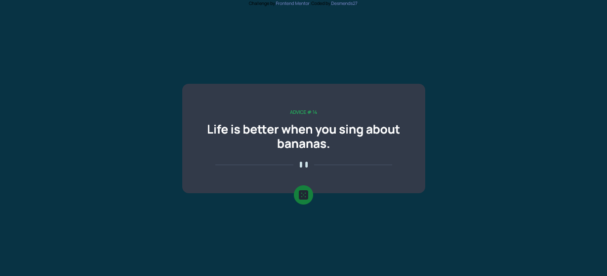

# Frontend Mentor - Advice generator app solution

This is a solution to the [Advice generator app challenge on Frontend Mentor](https://www.frontendmentor.io/challenges/advice-generator-app-QdUG-13db). Frontend Mentor challenges help you improve your coding skills by building realistic projects.

## Table of contents

- [Overview](#overview)
  - [The challenge](#the-challenge)
  - [Screenshot](#screenshot)
  - [Links](#links)
- [My process](#my-process)
  - [Built with](#built-with)
  - [What I learned](#what-i-learned)
  - [Continued development](#continued-development)
  - [Useful resources](#useful-resources)
- [Author](#author)
**Note: Delete this note and update the table of contents based on what sections you keep.**

## Overview

### The challenge

Users should be able to:

- View the optimal layout for the app depending on their device's screen size
- See hover states for all interactive elements on the page
- Generate a new piece of advice by clicking the dice icon

### Screenshot




### Links

- Solution URL: (https://github.com/Desmends27/advice-generator-app)
- Live Site URL: (https://desmends27.github.io/advice-generator-app/)

## My process

### Built with

- Semantic HTML5 markup
- CSS custom properties
- Flexbox
-Tailwind css

**Note: These are just examples. Delete this note and replace the list above with your own choices**

### What I learned

Basic usage of asyc and wait with catch methods

To see how you can add code snippets, see below:

```js
    let response = await fetch("https://api.adviceslip.com/advice")
    let quote = await response.json()
    return quote
```


### Continued development

The mobile design could still use a bit more work

### Useful resources

- [Asyc/ Await article](https://javascript.info/async-await) - This helped me learn asyc and wait and how to use them.


## Author

- Frontend Mentor - [@yourusername](https://www.frontendmentor.io/profile/Desmends27)


